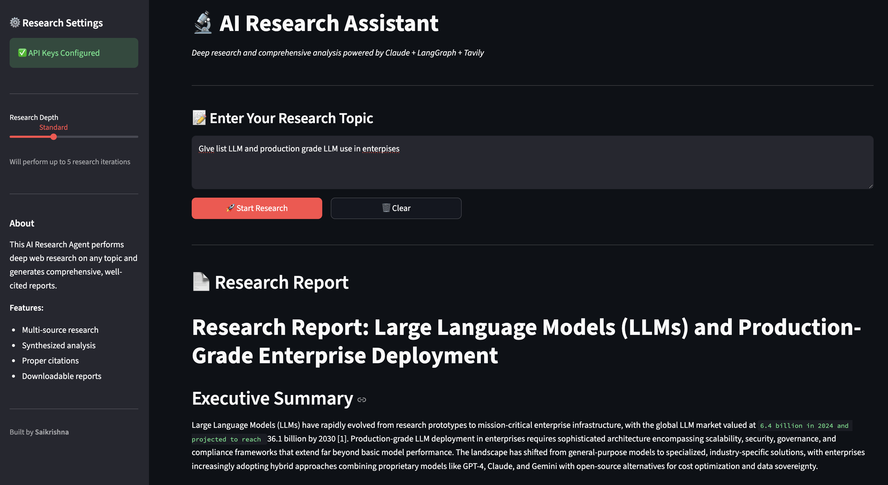

<p align="center">
  
</p>

<h1 align="center">AI Research Assistant</h1>

<p align="center">
  <strong>An intelligent research agent that performs deep web research and generates comprehensive, well-cited reports</strong>
</p>

<p align="center">
  <a href="#features">Features</a> •
  <a href="#demo">Demo</a> •
  <a href="#tech-stack">Tech Stack</a> •
  <a href="#architecture">Architecture</a> •
  <a href="#installation">Installation</a> •
  <a href="#usage">Usage</a> •
  <a href="#sample-output">Sample Output</a>
</p>

<p align="center">
  
  
  
  
  
</p>

<p align="center">
  
  
  
</p>

<div align="center">

### 🛠️ Built With

<table>
<tr>
<td align="center" width="100">

<br /><b>Python</b>
</td>
<td align="center" width="100">

<br /><b>Claude AI</b>
</td>
<td align="center" width="100">

<br /><b>LangGraph</b>
</td>
<td align="center" width="100">

<br /><b>Tavily</b>
</td>
<td align="center" width="100">

<br /><b>Streamlit</b>
</td>
</tr>
</table>

</div>

---

## Overview

The **AI Research Assistant** is a production-grade research agent built with the **ReAct (Reasoning + Acting)** pattern. Unlike simple LLM calls, this agent dynamically plans its research strategy, executes multiple web searches, synthesizes information from diverse sources, and produces comprehensive research reports with proper citations.

### Why This Project?

| Traditional Research | AI Research Assistant |
|---------------------|----------------------|
| Manual web searches | Automated multi-query search |
| Hours of reading | Minutes to comprehensive report |
| Copy-paste citations | Auto-generated references |
| Single perspective | Multi-source synthesis |
| No structure | Professional report format |

---

## Features

| Feature | Description |
|---------|-------------|
| **Deep Research** | Performs 3-10+ targeted searches based on research depth |
| **ReAct Pattern** | Uses Think → Act → Observe → Repeat loop for intelligent research |
| **Multi-Source Synthesis** | Aggregates information from multiple web sources |
| **Proper Citations** | Auto-generates numbered references with URLs |
| **Comprehensive Reports** | Executive summary, key findings, analysis, and conclusions |
| **Downloadable Output** | Export reports as Markdown files |
| **Adjustable Depth** | Quick, Standard, Deep, or Comprehensive research modes |
| **Real-time Progress** | Watch the agent's search queries as it researches |
| **Session Persistence** | Reports persist across interactions |

---

## Demo

<p align="center">
  
</p>

<p align="center"><em>AI Research Assistant generating a comprehensive report on Enterprise LLMs</em></p>

---

## Tech Stack

### Dependencies

```
anthropic>=0.40.0        # Anthropic API client
langchain-anthropic>=0.3.0   # LangChain Claude integration
langgraph>=0.2.0         # Agent orchestration framework
langchain-core>=0.3.0    # LangChain core utilities
tavily-python>=0.5.0     # Tavily search API
streamlit>=1.40.0        # Web interface
python-dotenv>=1.0.0     # Environment management
pydantic>=2.5.0          # Data validation
```

---

## Architecture

### ReAct Agent Pattern

The agent follows the **ReAct (Reasoning + Acting)** pattern, which enables dynamic decision-making:

```
┌─────────────────────────────────────────────────────────────┐
│                      USER QUERY                             │
│           "Research latest advances in RAG"                 │
└─────────────────────┬───────────────────────────────────────┘
                      │
                      ▼
┌─────────────────────────────────────────────────────────────┐
│                    AGENT NODE                               │
│  ┌─────────────────────────────────────────────────────┐    │
│  │  THINK: "I need to search for RAG techniques,       │    │
│  │          recent papers, and practical applications" │    │
│  └─────────────────────────────────────────────────────┘    │
└─────────────────────┬───────────────────────────────────────┘
                      │
                      ▼
┌─────────────────────────────────────────────────────────────┐
│                    ROUTER                                   │
│         Has tool calls? ──YES──► Execute Tools              │
│                │                                            │
│               NO                                            │
│                │                                            │
│                ▼                                            │
│         Return Final Report                                 │
└─────────────────────┬───────────────────────────────────────┘
                      │
           ┌──────────┴──────────┐
           │                     │
           ▼                     ▼
┌──────────────────┐   ┌──────────────────┐
│   TOOL NODE      │   │   END            │
│  Execute Search  │   │  Return Report   │
│  via Tavily API  │   │                  │
└────────┬─────────┘   └──────────────────┘
         │
         │ Results
         ▼
┌─────────────────────────────────────────────────────────────┐
│                    AGENT NODE                               │
│  ┌─────────────────────────────────────────────────────┐    │
│  │  OBSERVE: Process search results                    │    │
│  │  THINK: "Need more info on specific techniques..."  │    │
│  │  ACT: Call search_web again OR write final report   │    │
│  └─────────────────────────────────────────────────────┘    │
└─────────────────────────────────────────────────────────────┘
                      │
                      │ (Loop continues until complete)
                      ▼
```

### Project Structure

```
autonomous-research-agent/
├── app/
│   └── streamlit_app.py      # Web UI with Streamlit
├── src/
│   ├── __init__.py
│   ├── config.py             # Configuration & API keys
│   ├── state.py              # Agent state definition
│   ├── prompts.py            # System prompts for Claude
│   ├── agent.py              # Agent node implementation
│   ├── workflow.py           # LangGraph workflow definition
│   └── tools/
│       ├── __init__.py
│       └── search.py         # Tavily search tool
├── assets/
│   ├── screenshot.png        # App screenshot
│   └── sample_report.md      # Example output
├── .env.example              # Environment template
├── requirements.txt          # Dependencies
└── README.md                 # This file
```

---

## Installation

### Prerequisites

- Python 3.10 or higher
- Anthropic API key ([Get one here](https://console.anthropic.com/))
- Tavily API key ([Get one here](https://tavily.com/))

### Step-by-Step Setup

1. **Clone the repository**
   ```bash
   git clone https://github.com/yourusername/ai-research-assistant.git
   cd ai-research-assistant
   ```

2. **Create virtual environment**
   ```bash
   python -m venv .venv
   source .venv/bin/activate  # On Windows: .venv\Scripts\activate
   ```

3. **Install dependencies**
   ```bash
   pip install -r requirements.txt
   ```

4. **Configure environment variables**
   ```bash
   cp .env.example .env
   ```

   Edit `.env` and add your API keys:
   ```env
   ANTHROPIC_API_KEY=your_anthropic_api_key_here
   TAVILY_API_KEY=your_tavily_api_key_here
   ```

5. **Run the application**
   ```bash
   streamlit run app/streamlit_app.py
   ```

6. **Open in browser**
   ```
   http://localhost:8501
   ```

---

## Usage

### Research Depth Options

| Depth | Iterations | Best For |
|-------|------------|----------|
| **Quick** | 3 | Simple questions, quick overviews |
| **Standard** | 5 | General research topics |
| **Deep** | 7 | Complex topics requiring multiple perspectives |
| **Comprehensive** | 10 | Academic-level research with extensive citations |

### Example Queries

```
✓ "What are the latest advances in Chain of Thought reasoning for LLMs?"
✓ "Compare RAG vs Fine-tuning for enterprise applications"
✓ "Explain production-grade LLM deployment best practices"
✓ "What are the emerging trends in AI agents for 2025?"
```

### Downloading Reports

After research completes:
1. Click **"Download Report (.md)"** button
2. Report saves as Markdown file
3. Open in any Markdown viewer or convert to PDF

---

## Sample Output

The agent generates comprehensive research reports with:

- **Executive Summary** - High-level overview
- **Introduction** - Background and context
- **Key Findings** - Detailed analysis with citations
- **Recent Developments** - Latest trends (2024-2025)
- **Analysis & Implications** - Expert insights
- **Conclusion** - Key takeaways
- **References** - Numbered citations with URLs

### Example Report Preview

> **Research Report: Large Language Models (LLMs) and Production-Grade Enterprise Deployment**
>
> ## Executive Summary
> Large Language Models (LLMs) have rapidly evolved from research prototypes to mission-critical enterprise infrastructure, with the global LLM market valued at $6.4 billion in 2024 and projected to reach $36.1 billion by 2030 [1]...

**[View Full Sample Report](assets/sample_report.md)**

---

## Key Learnings

This project demonstrates several important AI engineering concepts:

| Concept | Implementation |
|---------|----------------|
| **ReAct Pattern** | Agent dynamically reasons and acts based on observations |
| **Tool Use** | Claude calls external tools (Tavily search) when needed |
| **State Management** | LangGraph manages conversation state across iterations |
| **Prompt Engineering** | System prompts guide Claude's research behavior |
| **Streaming** | Real-time updates as agent progresses |

---

## Configuration

### Environment Variables

| Variable | Description | Required |
|----------|-------------|----------|
| `ANTHROPIC_API_KEY` | Anthropic API key for Claude | Yes |
| `TAVILY_API_KEY` | Tavily API key for web search | Yes |

### Model Settings (src/config.py)

```python
CLAUDE_MODEL = "claude-sonnet-4-20250514"  # Best for agents
MAX_ITERATIONS = 12                         # Max agent loops
MAX_SEARCH_RESULTS = 5                      # Results per search
```

---

## Troubleshooting

| Issue | Solution |
|-------|----------|
| "API Key not configured" | Check `.env` file has valid keys |
| Empty report generated | Increase research depth or rephrase query |
| Rate limit errors | Wait a moment and retry |
| Import errors | Ensure virtual environment is activated |

---

## Future Enhancements

- [ ] PDF export option
- [ ] Multiple report formats
- [ ] Research history database
- [ ] Custom search sources
- [ ] Citation style options (APA, MLA, etc.)
- [ ] Multi-language support

---

## Contributing

Contributions are welcome! Please feel free to submit a Pull Request.

1. Fork the repository
2. Create your feature branch (`git checkout -b feature/AmazingFeature`)
3. Commit your changes (`git commit -m 'Add some AmazingFeature'`)
4. Push to the branch (`git push origin feature/AmazingFeature`)
5. Open a Pull Request

---

## License

This project is licensed under the MIT License - see the [LICENSE](LICENSE) file for details.

---

## Acknowledgments

- [Anthropic](https://anthropic.com/) for Claude API
- [LangChain](https://langchain.com/) for LangGraph framework
- [Tavily](https://tavily.com/) for AI-optimized search API
- [Streamlit](https://streamlit.io/) for the web interface

---

<p align="center">
  <strong>Built with ❤️ by Saikrishna</strong>
</p>

<p align="center">
  <a href="https://github.com/yourusername">
    
  </a>
  <a href="https://linkedin.com/in/yourusername">
    
  </a>
</p>

---

<p align="center">
  <sub>Part of the <strong>12 AI Projects for 2026</strong> series</sub>
</p>
